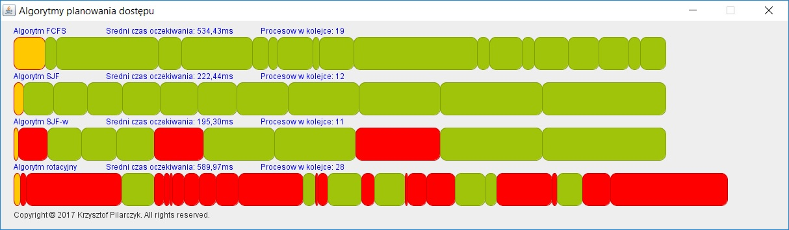

  

 
<h1> Systemy operacyjne </h1>
<h2> Zadanie 1</h2>
<h3> Data: 13.03.2017r </h3>
Program ma symulować działanie algorytmów planowania dostępu do procesora dla zgłaszających się procesów. 
Zbadać średni czas oczekiwania procesów dla różnych algorytmów planowania: 
- FCFS 
- SJF (z wywłaszczaniem i bez) 
- rotacyjnego (z możliwością wyboru kwantu czasu) 
Należy samodzielnie sformułować założenia symulacji. 